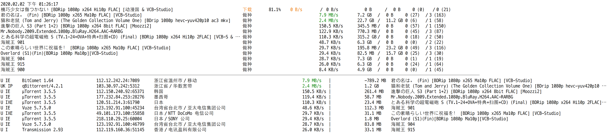

# uTorrent 自动屏蔽迅雷脚本 (Xunlei Blocker of uTorrent)

<p align='center'>
    
</p>

<h2 align='center'>
    uTorrent 自动屏蔽迅雷脚本
</h2>
<h3 align='center'>
    Xunlei Blocker of uTorrent
</h3>

<p align='center'>
    <a href='https://www.npmjs.com/package/utorrent-block-xunlei' target='_blank'>
        
    </a>
    <a href='https://www.npmjs.com/package/utorrent-block-xunlei' target='_blank'>
        
    </a>
</p>

## 中文 | [English](./README.en.md)

## 功能
### 每隔 30 秒，自动检查 uTorrent 已连接的用户列表，找出迅雷客户端，强制断开，不给吸血雷上传任何数据，并将用户 IP 加入黑名单阻止其再次连接，把带宽留给正规 BT 客户端

- 支持 IP 定位，可根据地理位置屏蔽 peers

- 批量可编程式修改 uTorrent 的 resume.dat 内保存的任务信息，从而:
    - 在任务或下载文件丢失后，通过修改 resume.dat 跳过文件强制检查，继续做种
    - 可以批量修改本地文件的路径和文件名，并建立到原有种子文件内文件信息的映射，保持继续做种的能力
    - 批量重命名任务，恢复上传量、下载量
    - 提供 API 修改 resume.dat 内保存的任何信息

- 命令行监控，实时查看 peers 情况  

- 反吸血屏蔽策略，下载时对有上传流量的 peers 放宽处理，如下
    ```ts
    this.should_block = this.torrent.state[0] === '做种' ?
        /-XL0012-|Xunlei|^7\.|aria2|Xfplay|dandanplay|FDM|go\.torrent|Mozilla/i.test(this.client) && this.upload_speed > 10 * 2 ** 10
    : this.torrent.state[0] === '下载' ?
        /-XL0012-|Xunlei|^7\.|aria2|Xfplay|dandanplay|FDM|go\.torrent|Mozilla/i.test(this.client) && this.uploaded > this.downloaded * 10 + 5 * 2**20
    :
        false
    ```

## 屏蔽列表
### 完全屏蔽
-XL0012-***  
Xunlei/***  
7.x.x.x
### 反吸血屏蔽 (下载量超过上传量的两倍时屏蔽)
Xfplay  
FDM  
dandanplay  
Mozilla  
go.torrent


## 屏蔽算法
1. 根据 uTorrent 的 WebUI API 发送 HTTP 请求，获取所有已连接用户 (peers) 信息
2. 按照用户 (peer) 的客户端名称 (client) 筛选出使用迅雷的用户，将 IP 写入 ipfilter.dat 文件
3. 发送 HTTP 请求让 uTorrent 重新加载 ipfilter.dat
4. uTorrent 禁止 ipfilter.dat 中的 IP 连接


## 预览
### 命令行监控



### resume.dat 解析及文件重定向


## 使用方法
1. 确保 uTorrent 已开启 WebUI (网页界面)  
1.1 打开 uTorrent 设置 > 高级 > 网页界面  
1.2 选上 "启用网页界面", 并在下方填写用户和密码, 记下来, 作为命令行 username 和 password 参数的值  
2. 在 uTorrent 安装目录下保证 ipfilter.dat 文件存在（若不存在则新建空白 ipfilter.dat 文件），脚本会在原有 ipfilter.dat 文件内容之后添加被屏蔽的迅雷 IP，不影响已有内容及其功能
3. 安装最新版 Node.js: https://nodejs.org/en/
4. 安装: `npm i --global utorrent-block-xunlei`
5. 查看用法: `utorrent-block-xunlei --help`
```text
Usage: utorrent-block-xunlei --port 50050 --username tom --password 123456 --ipfilter "C:/Users/tom/AppData/Roaming/uTorrent/ipfilter.dat"

Xunlei Blocker of uTorrent

Options:
  -V, --version          output the version number
  --hostname [hostname]  选填, uTorrent WebUI 主机的 hostname, 默认为本机 127.0.0.1, 也可设置远程主机 IP 或域名 (default: "127.0.0.1")
  --port <port>          必填, "uTorrent 设置 > 连接 > 监听端口 > 传入连接所使用的端口" 中设置的端口号
  --username <username>  必填, "uTorrent 设置 > 高级 > 网页界面 > 身份验证 > 用户" 中设置的用户名
  --password <password>  必填, "uTorrent 设置 > 高级 > 网页界面 > 身份验证 > 密码" 中设置的密码
  --ipfilter <ipfilter>  必填, uTorrent 数据目录中 ipfilter.dat 文件的完整路径，如: C:/Users/tom/AppData/Roaming/uTorrent/ipfilter.dat
  --interval [interval]  选填, 检测 peers 的间隔（秒）, 默认每隔 20 秒检测并屏蔽一次 (default: "20")
  -h, --help             display help for command
```

6. 启动 blocker (修改下参数的值): `utorrent-block-xunlei --port 50050 --username tom --password 123456 --ipfilter "C:/Users/tom/AppData/Roaming/uTorrent/ipfilter.dat"`

7. (可选，不影响屏蔽功能) 在 uTorrent 中开启屏蔽日志，查看被屏蔽的连接请求
    4.1 在 uTorrent 下方的日志面板中点击右键
    4.2 勾选 `记录用户通讯信息 > 记录拦截连接`
    4.3 有被屏蔽的用户连接时可以在 uTorrent 日志面板中看到类似下面的日志
```text
[2018-11-22 19:03:43]  Loaded ipfilter.dat (51 entries)
[2018-11-22 19:03:46]  IpFilter blocked peer 223.81.192.235
[2018-11-22 19:03:49]  IpFilter blocked peer 223.81.192.235
[2018-11-22 19:04:06]  IpFilter blocked peer 223.81.192.235
[2018-11-22 19:04:21]  IpFilter blocked peer 183.25.54.216
[2018-11-22 19:04:46]  IpFilter blocked peer 223.81.192.235
...
```


## API
```ts
import { UTorrent, Torrent, Peer, TorrentData, TorrentFile, ResumeData } from 'utorrent-block-xunlei'

let utorrent = await UTorrent.connect({
    root_url: 'http://127.0.0.1:50050/gui/',
    username: 'xxx',
    password: 'xxxxxxxx',
    ipfilter_dat: 'C:/Users/xxx/AppData/Roaming/uTorrent/ipfilter.dat',
    interval: 20 * 1000,
    print: {
        torrents: '所有',
        peers: true
    }
})

utorrent.start_blocking()

utorrent.hide_display()

utorrent.show_display()

utorrent.stop_blocking()

utorrent.reset_ipfilter()

utorrent.block_peers()

utorrent.print_blockeds()

utorrent.state
```

## 相关项目
- Python 命令行工具 ban-peers: [https://github.com/SeaHOH/ban-peers](https://github.com/SeaHOH/ban-peers)
- Python 脚本实现: [https://github.com/yefengo/utorrent-block-xunlei](https://github.com/yefengo/utorrent-block-xunlei)
- qBittorrent-Enhanced-Edition: [https://github.com/c0re100/qBittorrent-Enhanced-Edition](https://github.com/c0re100/qBittorrent-Enhanced-Edition)
